##                                                                                            计算机网络实验

## 验证性实验

### 实验一

####    Ipconfig

​      `ipconfig` 是微软操作系统的计算机上用来控制网络连接的一个命令行工具。它的主要用来显示当前网络连接的配置信息（`/all` 参数）。

#####    常用命令

   若要显示所有适配器的基本 TCP/IP 配置，请键入：

```
ipconfig
```

若要显示所有适配器的完整 TCP/IP 配置，请键入：

```
ipconfig /all
```

若要仅为"本地连接"适配器续订 DHCP 分配的 IP 地址配置，请键入：

```
ipconfig /renew Local Area Connection
```

若要在排查 DNS 名称解析问题时刷新 DNS 解析程序缓存，请键入：

```
ipconfig /flushdns
```

若要显示名称以 Local 开始的所有适配器的 DHCP 类 ID，请键入：

```
ipconfig /showclassid Local*
```

若要将"局部区域连接"适配器的 DHCP 类 ID 设置为 TEST，请键入：

```
ipconfig /setclassid Local Area Connection TEST
```

#####  实作一

  使用 `ipconfig/all` 查看**自己**计算机的网络配置，尽可能明白每行的意思，特别注意 `IP` 地址、子网掩码 `Subnet Mask`、网关 `Gateway`。

   

#####  实作二


该图是放在虚拟机下生成的Linux版本ipconfig,由图可知位于同一子网。

### 实验二


#### ping

`        ping`（Packet Internet Groper），因特网包探索器，用于测试网络连接量的程序 。`ping` 是工作在 TCP/IP 网络体系结构中应用层的一个服务命令， 主要是向特定的目的主机发送 ICMP（Internet Control Message Protocol 因特网报文控制协议）Echo 请求报文，测试目的站是否可达及了解其有关状态。

#### 常用命令

```
-t ：Ping 指定的计算机直到中断。

-a ：将地址解析为计算机名。

-n count ：发送 count 指定的 ECHO 数据包数。默认值为 4。

-l size ：发送包含由 size 指定的数据量的 ECHO 数据包。默认为 32 字节；最大值是65,527。

-f ：在数据包中发送"不要分段"标志。数据包就不会被路由上的网关分段。

-i ttl :将"生存时间"字段设置为 ttl 指定的值。

-v tos :将"服务类型"字段设置为 tos 指定的值。

-r count :在"记录路由"字段中记录传出和返回数据包的路由。count 可以指定最少 1 台，最多 9 台计算机。

-s count :指定 count 指定的跃点数的时间戳。

-j host-list :利用 host-list 指定的计算机列表路由数据包。连续计算机可以被中间网关分隔（路由稀疏源）IP 允许的最大数量为 9。

-k host-list :利用 host-list 指定的计算机列表路由数据包。连续计算机不能被中间网关分隔（路由严格源）IP 允许的最大数量为 9。

-w timeout :指定超时间隔，单位为毫秒。

destination-list :指定要 ping 的远程计算机。
```


##### 实作一

​    要测试到某计算机如 重庆交通大学 Web 服务器的连通性，可以使用 `ping www.cqjtu.edu.cn` 命令，也可直接使用 IP 地址。

请掌握使用该命令后屏幕显示的反馈回来信息的意思，如：TTL、时间等。

​    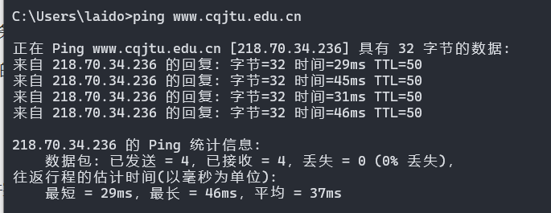

可得IP地址为218.70.34.236.

##### 实作二

​    使用 `ping/?` 命令了解该命令的各种选项并实际使用。

 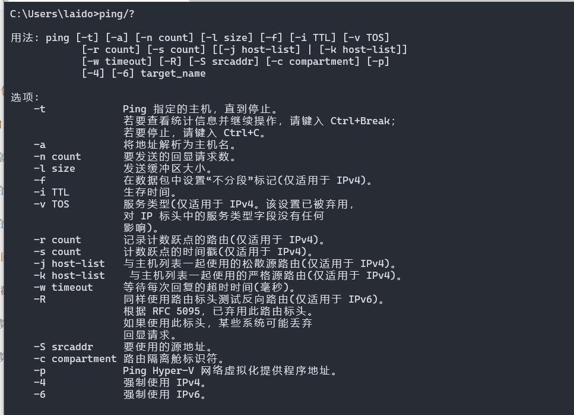

###### 1.使用 ping -t

不间断地ping指定计算机，知道管理员中断。

   


###### 2.使用ping -a

 Ping-a解析计算机名与NetBios名。就是可以通过ping它的IP地址，可以解析出主机名


学校iP地址应该有防火墙设置 得不到主机名字

###### 3.使用ping -n

 该方法指定了发送包数量 一般默认为4

###### 4.使用ping-I size

  在默认的情况下Windows的ping发送的数据包大小为32byte，最大能发送65500byte。当一次发送的数据包大于或等于65500byte时，将可能导致接收方计算机宕机。所以微软限制了这一数值；这个参数配合其它参数以后危害非常强大，比如攻击者可以结合-t参数实施DOS攻击。（所以它具有危险性，不要轻易向别人计算机使用）。

 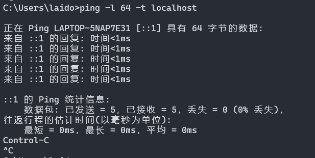

###### 6.使用ping-r count

  在“记录路由”字段中记录传出和返回数据包的路由，探测经过的路由个数，但最多只能跟踪到9个路由。

 尝试过许多IP地址现在都不返回经过路由了

###### 7.其他ping 问题

```
TroubleShooting——
假设你不能 `ping` 通某计算机或 IP，但你确定该计算机和你之间的网络是连通的，那么可能的原因是什么？该如何处理能保证 `ping` 通？
答：可能的原因是对方服务器关闭了，让对方开启即可
```

```
📬 秘籍

当你的网络出现故障不能访问某计算机如 `14.215.177.39` (百度的 IP 地址之一 ) 时，我们一般可采用由近及远的连通性测试来确定问题所在。现假设你的 IP 是 `192.168.1.89`，你旁边计算机的 IP 是 `192.168.1.64`，网关的 IP 是 `192.168.1.1` ，那么过程如下：

1. `ping 127.0.0.1` ，测试自己计算机的状态，如果 OK，那么说明本机网络软件硬件工作正常，否则，问题在本机，检查本机 TCP/IP 配置即网卡状态等
2. `ping 192.168.1.64` ，测试到旁边计算机的连通性，如果OK，那么说明本子网内部工作正常，否则，问题在本机网络出口到交换机之间，检查本机网卡到交换机的连线等
3. `ping 192.168.1.1`，测试到网关的连通性，如果 OK，那么说明本子网出口工作正常，否则，问题在网关，这是你无能为力的事情，报告给网管
4. `ping 14.215.177.39`，测试到百度的连通性，如果 OK，那就 OK，否则，问题在网关以外，这也是你无能为力的事情，报告给网管或者李彦宏？

假设在秘籍中进行的网络排查中，`ping` 百度的 IP 即 `ping 14.215.177.39` 没问题，但 `ping` 百度的域名即 `ping www.baidu.com` 不行，那么可能的原因是什么？如何进行验证和解决？

另外，经常有同学问到的："能上 QQ，但不能上网" 跟这个问题的原因是相似的。
答：可能的原因是 DNS 发生故障或设置错误而导致解析失败，因为域名是需要经过当地的 DNS 服务器解析成 IP ，再根据 IP 发送数据测试包。
验证和解决：1、咨询当地电信部门，是否当地 DNS 服务器故障；2、百度搜索当地 DNS 服务器地址，检查当前 DNS 服务器设置是否正确；3、可临时设置 DNS 服务器地址为 8.8.8.8，该服务器延迟会比较大。
```

### 实验三

#### tracert

`TRACERT` (Trace Route 的组合缩写)，也称为路由追踪，该命令行程序可用于跟踪 Internet 协议 （IP） 数据包传送到目标地址时经过的路径。

#### 常用命令

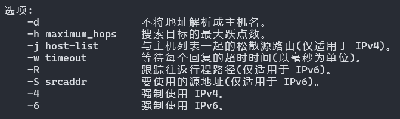

##### 实作一

   要了解到某计算机如 [www.baidu.com](http://www.cqjtu.edu.cn/) 中间经过了哪些节点（路由器）及其它状态，可使用 `tracert www.baidu.com`命令，查看反馈的信息，了解节点的个数。

  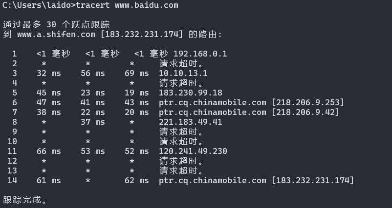

##### 实作二

  ping.ge这个网站可以探测从全球主要的 ISP 到某站点如 [https://qige.io](https://qige.io/) 的线路状态，当然也包括各线路到该主机的路由情况。请使用浏览器访问 http://ping.pe/qige.io 进行了解。

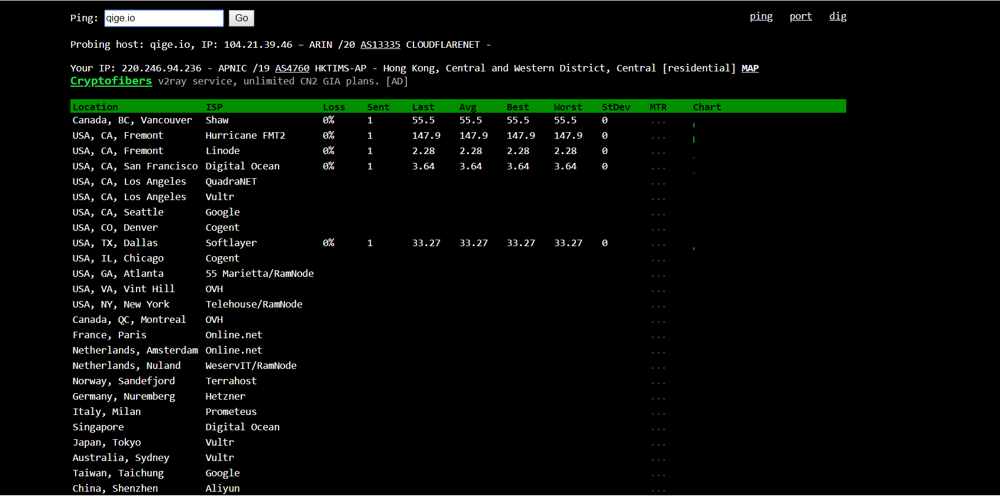

问题一

   tracert 能告诉我们路径上的节点以及大致的延迟等信息，那么它背后的原理是什么？本问题可结合第二部分的 Wireshark 实验进行验证。

答：无论什么都是通过路由器在通过浏览器访问的

 问题二

   在以上两个实作中，如果你留意路径中的节点，你会发现无论是访问百度还是棋歌教学网，路径中的第一跳都是相同的，甚至你应该发现似乎前几个节点都是相同的，你的解释是什么？

答：我们是处于内网，传输数据首先要到达网关。

问题三

   在追踪过程中，你可能会看到路径中某些节点显示为 * 号，这是发生了什么？

答：没有出现信息反馈。

### 实验四

#### ARP

   ARP（Address Resolution Protocol）即地址解析协议，是用于根据给定网络层地址即 IP 地址，查找并得到其对应的数据链路层地址即 MAC地址的协议。 ARP 协议定义在 1982 年的 RFC 826。

#### 常用命令

​       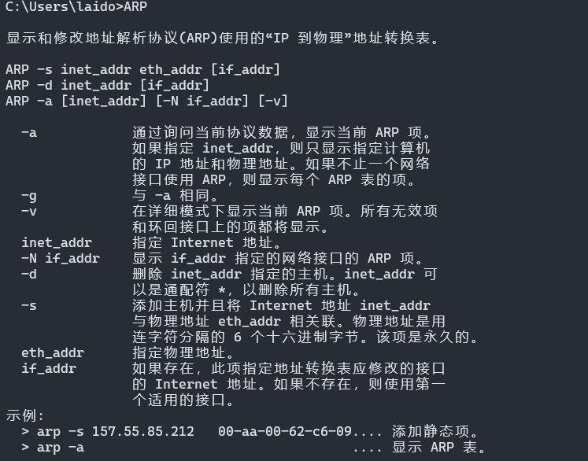

##### 实作一

​    运行 `arp -a` 命令查看当前的 arp 缓存， 请留意缓存了些什么。

然后 `ping` 一下你旁边的计算机 IP（注意，需保证该计算机的 IP 没有出现在 arp 缓存中，或者使用 `arp -d *` 先删除全部缓存），再次查看缓存，你会发现一些改变，请作出解释。

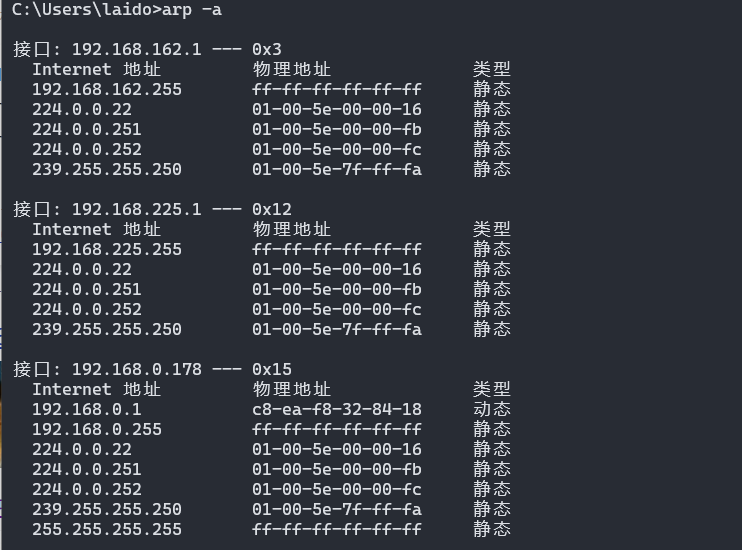


##### 实作二

   请使用 `arp /?` 命令了解该命令的各种选项。


##### 实作三

  一般而言，arp 缓存里常常会有网关的缓存，并且是动态类型的。

假设当前网关的 IP 地址是 `192.168.0.1`，MAC 地址是 `5c-d9-98-f1-89-64`，请使用 `arp -s 192.168.0.1 5c-d9-98-f1-89-64` 命令设置其为静态类型的。


###### 问题一

**你可能会在实作三的操作中得到 "ARP 项添加失败: 请求的操作需要提升" 这样的信息，表示命令没能执行成功，你该如何解决？**

答案：给予管理员权限

###### **问题二**

**在实作三中，为何缓存中常常有网关的信息？**

**我们将网关或其它计算机的 arp 信息设置为静态有什么优缺点？**

答：因为缓存记录的就自己访问的IP和MAC地址。
静态ARP表项通过手工配置和维护，不会被老化，不会被动态ARP表项覆盖。配置静态ARP表项可以增加通信的安全性。静态ARP表项可以限制和指定IP地址的设备通信时只使用指定的MAC地址，此时攻击报文无法修改此表项的IP地址和MAC地址的映射关系，从而保护了本设备和指定设备间的正常通信。

### 实验五

####  DHCP

​    DHCP（Dynamic Host Configuration Protocol）即动态主机配置协议，是一个用于 IP 网络的网络协议，位于 OSI 模型的应用层，使用 UDP 协议工作，主要有两个用途：

用于内部网或网络服务供应商自动分配 IP 地址给用户
用于内部网管理员对所有电脑作中央管理
简单的说，DHCP 可以让计算机自动获取/释放网络配置。

#### 实作一

  一般地，我们自动获取的网络配置信息包括：IP 地址、子网掩码、网关 IP 以及 DNS 服务器 IP 等。使用 `ipconfig/release` 命令释放自动获取的网络配置，并用 `ipconfig/renew` 命令重新获取，了解 DHCP 工作过程和原理。

   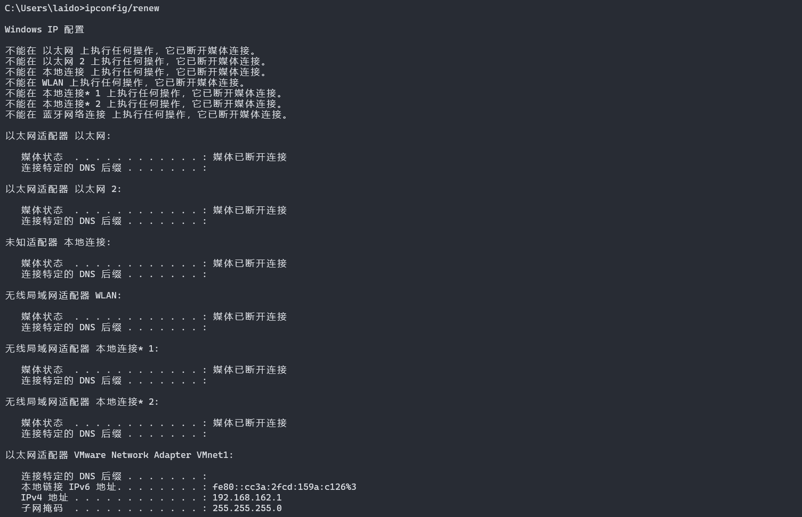

###### 问题

   **在Windows系统下，如果由于某种原因计算机不能获取 DHCP 服务器的配置数据，那么Windows将会根据某种算法自动配置为 169.254.x.x 这样的 IP 地址。显然，这样的 IP 以及相关的配置信息是不能让我们真正接入 Internet 的，为什么？既然不能接入 Internet，那么Winodws系统采用这样的方案有什么意义？**

答：自动配置的IP地址和信息只是短暂性的解决计算机不能获取 DHCP 服务器的配置数据的问题，要真正的接入Internet还是得本身计算机的正确IP地址。意义：假如某天因 DHCP 服务器问题从而不能获得网络配置，那么我们可以查看隔壁教室计算机的配置信息来手动进行网络配置，从而使该计算机能够接入 Internet。

###### 秘籍

  **在我校不少地方如教室，计算机都采用了 DHCP 来获得网络配置。假如某天因 DHCP 服务器问题从而不能获得网络配置，那么我们可以查看隔壁教室计算机的配置信息来手动进行网络配置，从而使该计算机能够接入 Internet。**

**经常的，在一个固定地方的网络配置我都喜欢采用 静态/手动配置，而不是动态 DHCP 来进行。你能想到是什么原因吗？**

答：因为 DHCP 维护的地址池是有限的，那么我可以不停的发出 DHCP 请求，从而导致 DHCP 地址耗尽。然后我自己再运行一个 DHCP 服务器来提供虚假的网络信息，特别是伪造的网关和 DNS 信息。手动配置没有自动请求分配地址的时间延迟网络连接更迅速;每台机器IP固定,更便于网络管理和使用。

### 实验六

#### netstat

  无论是使用 TCP 还是 UDP，任何一个网络服务都与特定的端口（Port Number）关联在一起。因此，每个端口都对应于某个通信协议/服务。

`netstat`（Network Statistics）是在内核中访问网络连接状态及其相关信息的命令行程序，可以显示路由表、实际的网络连接和网络接口设备的状态信息，以及与 IP、TCP、UDP 和 ICMP 协议相关的统计数据，一般用于检验本机各端口的网络服务运行状况。

#### 重用命令

```
-a或–all：显示所有连线中的Socket； 
-A<网络类型>或–<网络类型>：列出该网络类型连线中的相关地址； 
-c或–continuous：持续列出网络状态； 
-C或–cache：显示路由器配置的快取信息； 
-e或–extend：显示网络其他相关信息； 
-F或–fib：显示FIB； 
-g或–groups：显示多重广播功能群组组员名单； 
-h或–help：在线帮助； 
-i或–interfaces：显示网络界面信息表单； 
-l或–listening：显示监控中的服务器的Socket； 
-M或–masquerade：显示伪装的网络连线； 
-n或–numeric：直接使用ip地址，而不通过域名服务器； 
-N或–netlink或–symbolic：显示网络硬件外围设备的符号连接名称； 
-o或–timers：显示计时器； 
-p或–programs：显示正在使用Socket的程序识别码和程序名称； 
-r或–route：显示Routing Table； 
-s或–statistice：显示网络工作信息统计表； 
-t或–tcp：显示TCP传输协议的连线状况； 
-u或–udp：显示UDP传输协议的连线状况； 
-v或–verbose：显示指令执行过程； 
-V或–version：显示版本信息； 
-w或–raw：显示RAW传输协议的连线状况； 
-x或–unix：此参数的效果和指定”-A unix”参数相同； 
–ip或–inet：此参数的效果和指定”-A inet”参数相同。
```


##### 实作一

Windows 系统将一些常用的端口与服务记录在 `C:\WINDOWS\system32\drivers\etc\services` 文件中，请查看该文件了解常用的端口号分配。


##### 实作二

使用 `netstat -an` 命令，查看计算机当前的网络连接状况。更多的 `netstat` 命令选项


### 实验七

#### DNS

   DNS（Domain Name System）即域名系统，是互联网的一项服务。它作为将域名和 IP 地址相互映射的一个分布式数据库，能够使人更方便地访问互联网。DNS 使用 TCP 和 UDP 的 53 号端口。

####  nslookup常用命令

  

```
nslookup # 进入交互模式
域名  # 进行正向解析
IP地址  # 进行反向解析(有些地址不能反向解析)
lserver + IP地址  # 更换DNS服务器
set all  # 显示当前的查询设置
set type =MX  # 查询邮件交换记录
set type =ns  # 查询某子域的域名服务器
set type =AAAA    #查询域名对应的IPv6地址(查询IPv6站点有效:如bbs6.ustc.edu.cn)
设置完成后再进行查询即可
```

##### 实作一

Windows 系统将一些固定的/静态的 DNS 信息记录在 `C:\WINDOWS\system32\drivers\etc\hosts` 文件中，如我们常用的 `localhost` 就对应 `127.0.0.1` 。请查看该文件看看有什么记录在该文件中。

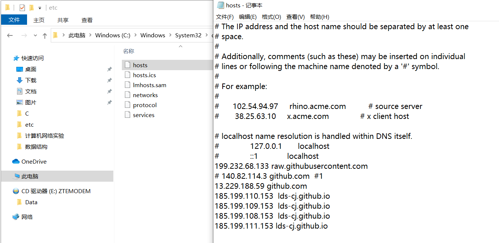

##### 实作二

​    解析过的 DNS 记录将会被缓存，以利于加快解析速度。请使用 `ipconfig /displaydns` 命令查看。我们也可以使用 `ipconfig /flushdns` 命令来清除所有的 DNS 缓存。


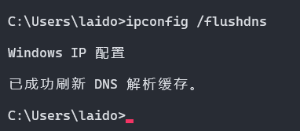

##### 实作三

​     使用 `nslookup qige.io` 命令，将使用默认的 DNS 服务器查询该域名。当然你也可以指定使用 `CloudFlare`（`1.1.1.1`）或 `Google`（`8.8.8.8`） 的全球 DNS 服务器来解析，如：`nslookup qige.io 8.8.8.8，当然，由于你懂的原因，这不一定会得到正确的答案。`

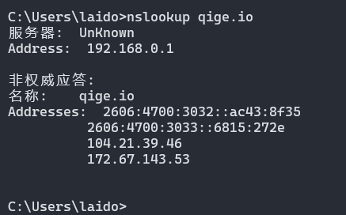

### 实验八

#### cache

   Cache 即缓存，是 IT 领域一个重要的技术。我们此处提到的 cache 主要是浏览器缓存。

浏览器缓存是根据 HTTP 报文的缓存标识进行的，是性能优化中简单高效的一种优化方式了。一个优秀的缓存策略可以缩短网页请求资源的距离，减少延迟，并且由于缓存文件可以重复利用，还可以减少带宽，降低网络负荷。

##### 实作一

​    打开 Chrome 或 Firefox 浏览器，访问 https://qige.io ，接下来敲 `F12` 键 或 `Ctrl + Shift + I` 组合键打开开发者工具，选择 `Network` 面板后刷新页面，你会在开发者工具底部看到加载该页面花费的时间。请进一步查看哪些文件被 cache了，哪些没有。


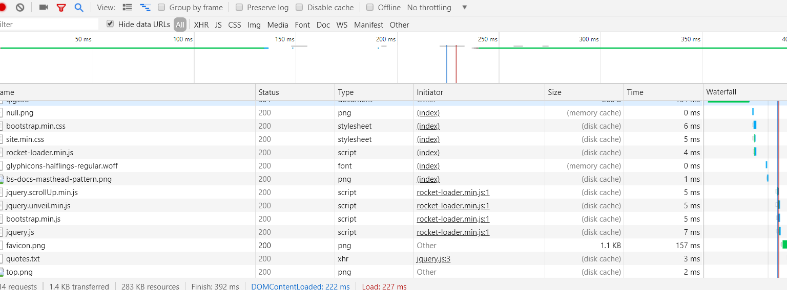

 从图中即可看出哪些文件被cache

##### 实作二

​    接下来仍在 `Network` 面板，选择 `Disable cache` 选项框，表明当前不使用 cache，页面数据全部来自于 Internet，刷新页面，再次在开发者工具底部查看加载该页面花费的时间。你可比对与有 cache 时的加载速度差异。


上幅图片显示加载用了227ms 选择了Disable cache 后明显加载时间增加 时间耗费了1.23s

## Wireshark 实验

### 数据链路层

#### 实作一 熟悉 Ethernet 帧结构

使用 Wireshark 任意进行抓包，熟悉 Ethernet 帧的结构，如：目的 MAC、源 MAC、类型、字段等。

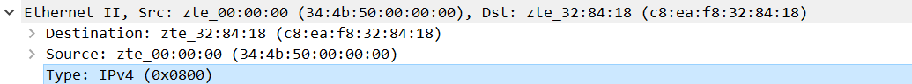

目的 MAC、源 MAC经过加密处理，次处类型为IPV4.

##### **问题**

你会发现 Wireshark 展现给我们的帧中没有校验字段，请了解一下原因

答：Wireshark 会忽略此检验字段

#### 实作二 了解子网内/外通信时的 MAC 地址

1. `ping` 你旁边的计算机（同一子网），同时用 Wireshark 抓这些包（可使用 icmp 关键字进行过滤以利于分析），记录一下发出帧的目的 MAC 地址以及返回帧的源 MAC 地址是多少？这个 MAC 地址是谁的？

   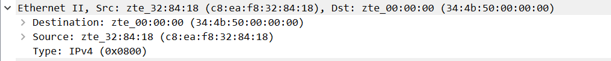

   

   发出帧的目的 MAC 地址以及返回帧的源 MAC 地址是zte_00:00:00(34:4b:50:00:00:00) 这个地址是ping 对象的

2. 然后 `ping qige.io` （或者本子网外的主机都可以），同时用 Wireshark 抓这些包（可 icmp 过滤），记录一下发出帧的目的 MAC 地址以及返回帧的源 MAC 地址是多少？这个 MAC 地址是谁的？

   

   

   发出帧的目的 MAC 地址以及返回帧的源 MAC 地址是zte_32:84:18(c8:ea:f8:32:84:18) 这个地址是qige.io的服务器MAC地址

3. 再次 `ping www.cqjtu.edu.cn` （或者本子网外的主机都可以），同时用 Wireshark 抓这些包（可 icmp 过滤），记录一下发出帧的目的 MAC 地址以及返回帧的源 MAC 地址又是多少？这个 MAC 地址又是谁的？

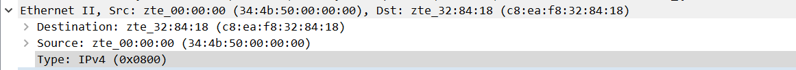


发出帧的目的 MAC 地址以及返回帧的源 MAC 地址是zte_32:84:18(c8:ea:f8:32:84:18) 这个地址是www.cqjtu.edu.cn的服务器MAC地址

#####  问题

通过以上的实验，你会发现：
访问本子网的计算机时，目的 MAC 就是该主机的，访问非本子网的计算机时，目的 MAC 是网关的
请问原因是什么？

因为本机接收到的本子网以外的信息必定经由网关发送给我，同理本机发送到本子往外信息的下个地址必定是网关的mac地址。而本子网内的可以直接到达。

#### 实作三 掌握 ARP 解析过程

1. 为防止干扰，先使用 `arp -d *` 命令清空 arp 缓存
2. `ping` 你旁边的计算机（同一子网），同时用 Wireshark 抓这些包（可 arp 过滤），查看 ARP 请求的格式以及请求的内容，注意观察该请求的目的 MAC 地址是什么。再查看一下该请求的回应，注意观察该回应的源 MAC 和目的 MAC 地址是什么。
3. 再次使用 `arp -d *` 命令清空 arp 缓存
4. 然后 `ping qige.io` （或者本子网外的主机都可以），同时用 Wireshark 抓这些包（可 arp 过滤）。查看这次 ARP 请求的是什么，注意观察该请求是谁在回应。

#####  **问题**

通过以上的实验，你应该会发现，

1. ARP 请求都是使用广播方式发送的
2. 如果访问的是本子网的 IP，那么 ARP 解析将直接得到该 IP 对应的 MAC；如果访问的非本子网的 IP， 那么 ARP 解析将得到网关的 MAC。

请问为什么？

 ARP代理，访问非子网IP时是通过路由器访问的，路由器再把发出去，目标IP收到请求后，再通过路由器端口IP返回去，那么ARP解析将会得到网关的MAC


### 网络层

#### 实作一 熟悉 IP 包结构

使用 Wireshark 任意进行抓包（可用 ip 过滤），熟悉 IP 包的结构，如：版本、头部长度、总长度、TTL、协议类型等字段。

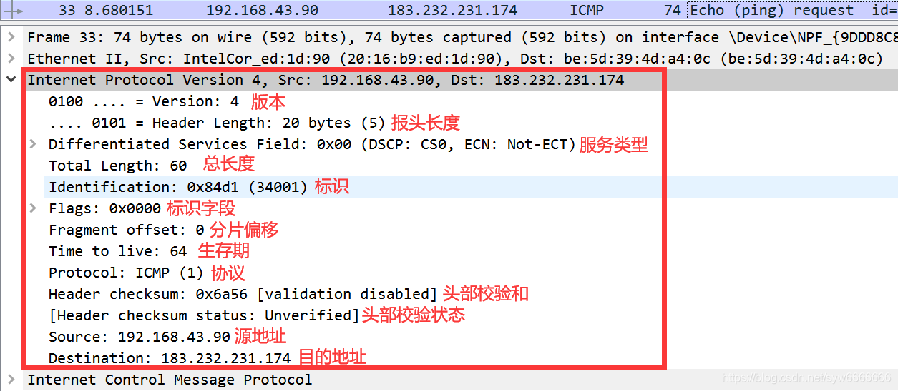

#####  **问题**

为提高效率，我们应该让 IP 的头部尽可能的精简。但在如此珍贵的 IP 头部你会发现既有头部长度字段，也有总长度字段。请问为什么？

答 ：便于传输时的识别IP总长度，节省时间，当长度超过15kb时就会被返回链路层进行分段。

#### 实作二 IP 包的分段与重组

根据规定，一个 IP 包最大可以有 64K 字节。但由于 Ethernet 帧的限制，当 IP 包的数据超过 1500 字节时就会被发送方的数据链路层分段，然后在接收方的网络层重组。

缺省的，`ping` 命令只会向对方发送 32 个字节的数据。我们可以使用 `ping www.cqjtu.edu.cn`  -l 2000` 命令指定要发送的数据长度。此时使用 Wireshark 抓包（用 `ip.addr == 218.70.34.236 进行过滤），了解 IP 包如何进行分段，如：分段标志、偏移量以及每个包的大小等


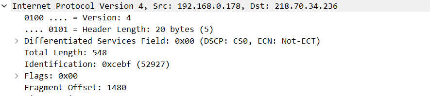

可以明显看到 分了两个包 因为最大1500，所以2000的包被分为了1500 和548 的两个包发出。

#####  **问题**

分段与重组是一个耗费资源的操作，特别是当分段由传送路径上的节点即路由器来完成的时候，所以 IPv6 已经不允许分段了。那么 IPv6 中，如果路由器遇到了一个大数据包该怎么办？

答：IPv6 中，如果路由器遇到了一个大数据包会直接丢弃，然后通知发送端重新传输。

#### 实作三 考察 TTL 事件

在 IP 包头中有一个 TTL 字段用来限定该包可以在 Internet上传输多少跳（hops），一般该值设置为 64、128等。

在验证性实验部分我们使用了 `tracert` 命令进行路由追踪。其原理是主动设置 IP 包的 TTL 值，从 1 开始逐渐增加，直至到达最终目的主机。

请使用 `tracert www.baidu.com` 命令进行追踪，此时使用 Wireshark 抓包（用 `icmp` 过滤），分析每个发送包的 TTL 是如何进行改变的，从而理解路由追踪原理。


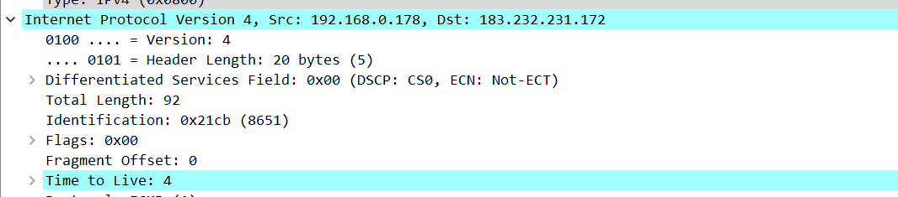

TTL 虽然定义为生命期即 Time To Liv，每到达一个节点返回一个TTL信息，TTL逐渐增加1直到到达目的主机。

#####  **问题**

在 IPv4 中，TTL 虽然定义为生命期即 Time To Live，但现实中我们都以跳数/节点数进行设置。如果你收到一个包，其 TTL 的值为 50，那么可以推断这个包从源点到你之间有多少跳？

答：至少50跳

### 传输层

#### 实作一 熟悉 TCP 和 UDP 段结构

1. 用 Wireshark 任意抓包（可用 tcp 过滤），熟悉 TCP 段的结构，如：源端口、目的端口、序列号、确认号、各种标志位等字段。

   

2. 用 Wireshark 任意抓包（可用 udp 过滤），熟悉 UDP 段的结构，如：源端口、目的端口、长度等。

   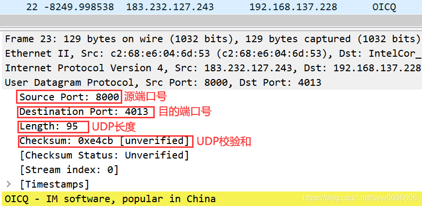

##### **问题**

由上大家可以看到 UDP 的头部比 TCP 简单得多，但两者都有源和目的端口号。请问源和目的端口号用来干什么？

答：源端口就是指本地端口，目的端口就是远程端口
源端口就是本机程序用来发送数据的端口，目的端口就是对方主机用哪个端口接收

#### 实作二 分析 TCP 建立和释放连接

1. 打开浏览器访问 qige.io 网站，用 Wireshark 抓包（可用 tcp 过滤后再使用加上 `Follow TCP Stream`），不要立即停止 Wireshark 捕获，待页面显示完毕后再多等一段时间使得能够捕获释放连接的包。

2. 请在你捕获的包中找到三次握手建立连接的包，并说明为何它们是用于建立连接的，有什么特征。

   

   注意到”第一次握手”客户端发送的TCP报文中以[SYN]作为标志位，并且客户端序号Seq=0；

   接下来”第二次握手”服务器返回的TCP报文中以[SYN，ACK]作为标志位；并且服务器端序号Seq=0；确认号Ack=1(“第一次握手”中客户端序号Seq的值+1);

   最后”第三次握手”客户端再向服务器端发送的TCP报文中以[ACK]作为标志位；其中客户端序号Seq=1（“第二次握手”中服务器端确认号Ack的值）；确认号Ack=1(“第二次握手”中服务器端序号Seq的值+1)。

3. 请在你捕获的包中找到四次挥手释放连接的包，并说明为何它们是用于释放连接的，有什么特征。

   

   第一次挥手”客户端发送的FIN请求释放连接报文以[FIN，ACK]作为标志位，其中报文序号Seq=800；确认号Ack=8785；
   ”第二次挥手”服务器端继续返回的FIN同意释放连接报文以[FIN，ACK]作为标志位；其中报文序号Seq=8809；确认号Ack=801；
   ”第三次挥手”客户端发出的ACK确认接收报文以[ACK]作为标志位；其中报文序号Seq=801；确认号Ack=8809；

   第四次挥手没从中发现

#####  问题一

去掉 `Follow TCP Stream`，即不跟踪一个 TCP 流，你可能会看到访问 `qige.io` 时我们建立的连接有多个。请思考为什么会有多个连接？作用是什么？

多个连接是为了更快的传输数据，为用户提供更好的服务。

#####  **问题二**

我们上面提到了释放连接需要四次挥手，有时你可能会抓到只有三次挥手。原因是什么？

答:是因为第二次握手和第三次挥手合并了，FIN报文用在本端没有数据发送给对方时，关闭从本端到对端的连接。但是并不影响从对方到本端的连接，也就是说本端仍然可以接收对方的数据。即发送通道关闭，接收通道正常。
如果对方收到本端FIN报文时，对方的接收通道就会关闭。此时，如果对方也没有数据发给本端，那么对方也会发送FIN给本端，用于关闭从对方到本端的连接，这时候就可能出现ACK和FIN合在一起的情况。
当然，如果对方仍然有数据发送，那么就等数据发完，再发FIN来关闭连接，这时候就是四次挥手了。

### 应用层

应用层的协议非常的多，我们只对 DNS 和 HTTP 进行相关的分析。

#### 实作一 了解 DNS 解析

1. 先使用 `ipconfig /flushdns` 命令清除缓存，再使用 `nslookup qige.io` 命令进行解析，同时用 Wireshark 任意抓包（可用 dns 过滤）。
2. 你应该可以看到当前计算机使用 UDP，向默认的 DNS 服务器的 53 号端口发出了查询请求，而 DNS 服务器的 53 号端口返回了结果。
3. 可了解一下 DNS 查询和应答的相关字段的含义

#####  **问题**

你可能会发现对同一个站点，我们发出的 DNS 解析请求不止一个，思考一下是什么原因？

#### 实作二 了解 HTTP 的请求和应答

1. 打开浏览器访问 qige.io 网站，用 Wireshark 抓包（可用http 过滤再加上 `Follow TCP Stream`），不要立即停止 Wireshark 捕获，待页面显示完毕后再多等一段时间以将释放连接的包捕获。
2. 请在你捕获的包中找到 HTTP 请求包，查看请求使用的什么命令，如：`GET, POST`。并仔细了解请求的头部有哪些字段及其意义。
3. 请在你捕获的包中找到 HTTP 应答包，查看应答的代码是什么，如：`200, 304, 404` 等。并仔细了解应答的头部有哪些字段及其意义。

#####  **问题**

刷新一次 qige.io 网站的页面同时进行抓包，你会发现不少的 `304` 代码的应答，这是所请求的对象没有更改的意思，让浏览器使用本地缓存的内容即可。那么服务器为什么会回答 `304` 应答而不是常见的 `200` 应答？
